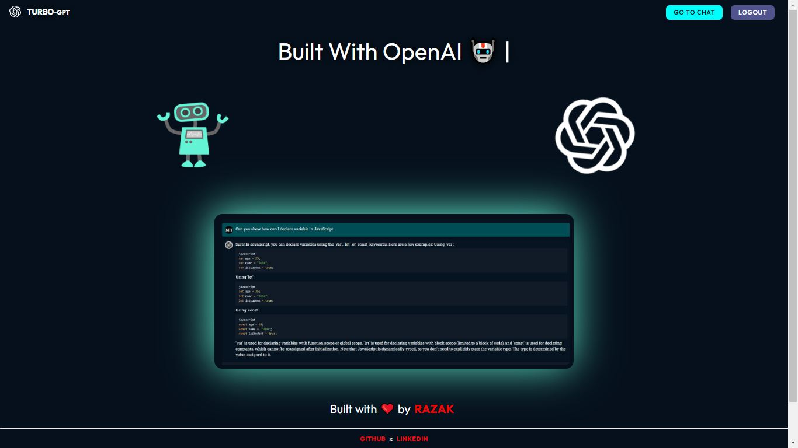
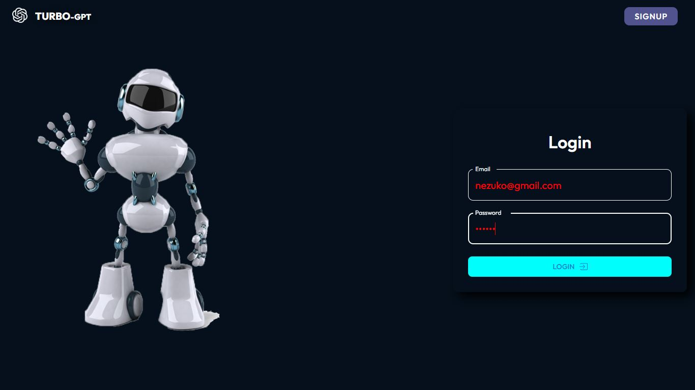
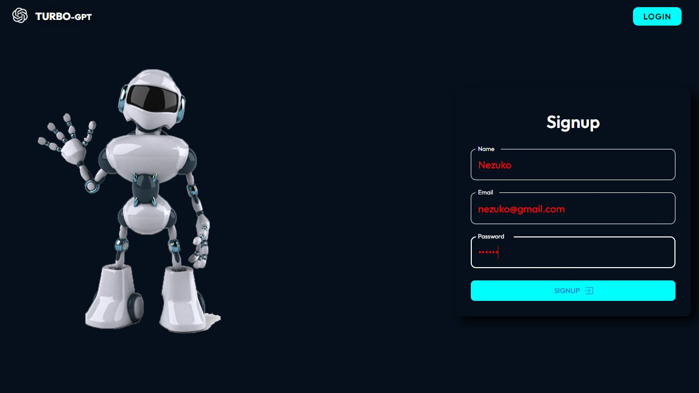
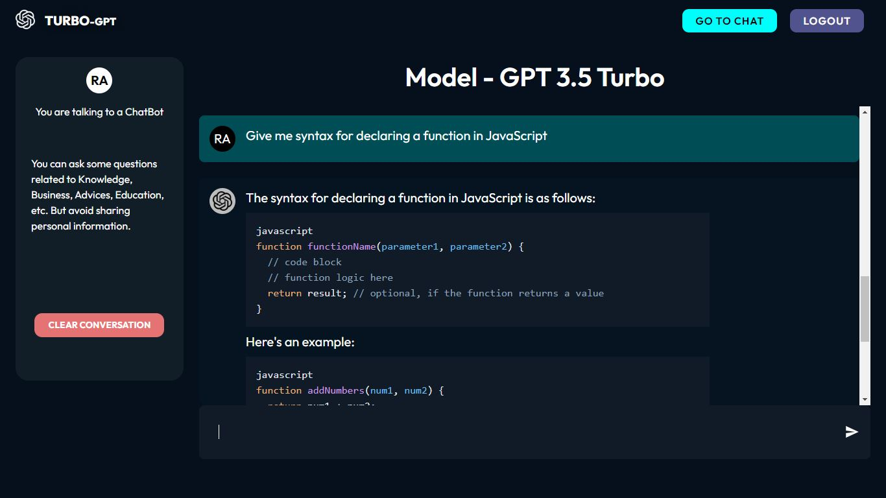

# MERN Stack AI Chatbot

Hi, my name is **Razak**, let me give the introduction about this full stack project.

## Project Overview

This is a full stack **AI Chatbot** application built using **MERN** stack and **OpenAI**, inspired by ChatGPT and named **TurboGPT**. It is fully responsive.

It's a customized chatbot where each message of the user is stored in the database and can be retrieved and deleted.

It's a completely secure application using **JWT Tokens**, **HTTP-Only Cookies**, **Signed Cookies**, **Password Encryption**, and **Middleware Chains**.

## Functionalities

### Client Side

- **Fully Secured Signup and Login Process**: The application ensures that user authentication and authorization are handled securely.
- **User Chat Functionality**: Users can chat with the AI in real-time, and the AI will respond to your questions just like ChatGPT.
- **User Can Delete Chat History**: Users can delete their chat history from the database.

#### Technologies Used

- **React.js**
- **Material UI**
- **ContextAPI**

### Server Side

- **Fully Secured Authentication and Authorization Process**: Implemented using **JWT** with **HTTP-Only Cookie Token**.
- **User Chat Functionality**: Managed from the backend side.

#### Technologies Used

- **Node.js**
- **Express.js**
- **express-validator**
- **jwt**
- **MongoDB**
- **Mongoose**
- **OpenAI API**

## Screenshots

**Home Page** 

 **Login Page** 

 **Signup Page** 

 **Chat Page** 

 **Turbo Server** 

## Usage

1. Register for a new account or login with your existing credentials.
2. Start chatting with TurboGPT and receive AI-powered responses.
3. View and manage your chat history.

⭐ If you like this project, please give it a star!

Created with ❤️ by [Razak Attar](https://github.com/razak571)
